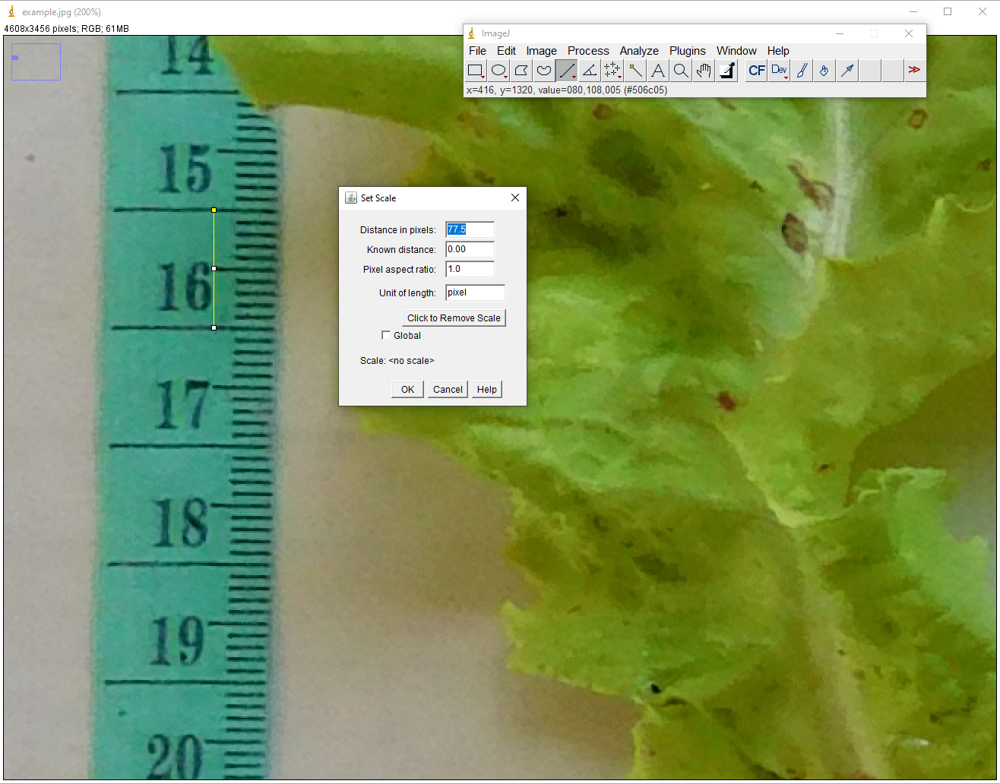
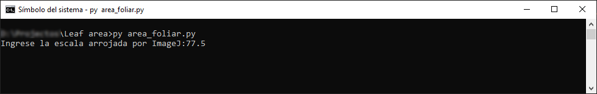
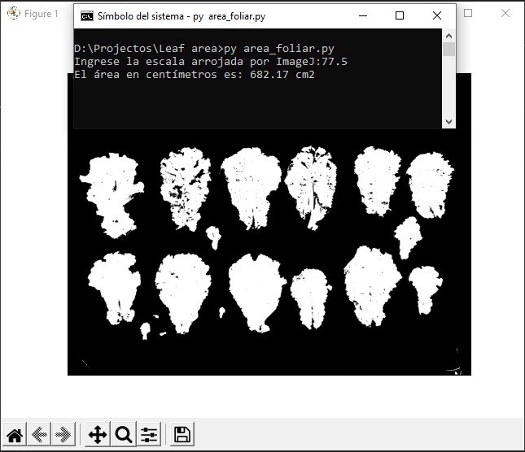

# leaf-area-with-ImageJ-and-Python
In this simple program, we calculate the leaf area of an image and the number of pixels per centimeter that imageJ gives us.

## Here we show an example of how to do it

First, we take the image and open it in ImageJ, and with the "Straight" tool we take the value of pixels in a centimeter, in the "Analyze" tab in "Set Scale" we take the value of
"Distance in pixels"

 Now we simply run our script, which will ask us for the image in question and the value of pixels per centimeter that we take from ImageJ

The program will then return the value of the area in square centimeters and an image of the area taken for the calculation, the program can be modified to change the green thresholds for the HSV color space.

